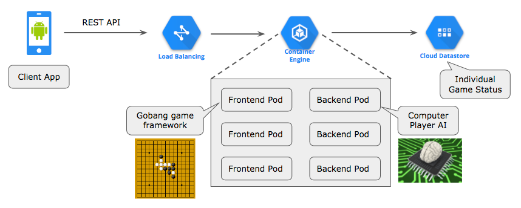

# Lab: Deploy a Sample Game API Application on GKE

Disclaimer: This is not an official Google product.

## Introduction
This guide will take you through the steps to build and deploy a sample game API application with the following architecture.



The following is the fictional story of this lab.

1. At some gaming company, you would deploy the API server for a brand new [Gobang (Five in a Row)](https://en.wikipedia.org/wiki/Gomoku) game.
2. Unfortunately, the engineering team failed to meet the release deadline to develop an intelligent computer player algorithm. So the initial version provides the dummy algorithm which plays randomly.
3. Once the engineering team has completed the development, you will replace the player algorithm with an intelligent one. Thanks to the rolling update mechanism of Kubernetes, you can do it without disrupting the service.

## Prerequisites
1. A Google Cloud Platform Account
1. [A new Google Cloud Platform Project](https://console.developers.google.com/project) for this lab with billing enabled.
1. [Enable the Google Compute Engine, Google Container Engine and Google Cloud Datastore APIs](https://console.cloud.google.com/flows/enableapi?apiid=compute_component,container,datastore)

## Do this first
In this section you will start your [Google Cloud Shell](https://cloud.google.com/cloud-shell/docs/) and clone the lab code repository to it.

1. [Open the Cloud Console](https://console.cloud.google.com/)

1. Click the Google Cloud Shell icon in the top-right and wait for your shell to open:


1. When the shell is open, set your default compute zone, and project ID which you have created for this lab.

  ```shell
  $ gcloud config set compute/zone us-central1-a
  $ export PROJECT_ID=$(gcloud config list project --format "value(core.project)")
  ```

1. Create an App Engine application. This is required to prepare the Cloud Datastore environment in the project.

  ```
  $ gcloud app create --region=us-central
  ```

1. Clone the lab repository in your cloud shell, then `cd` into that dir:

  ```shell
  $ git clone https://github.com/GoogleCloudPlatform/gke-gobang-app-example.git
  Cloning into 'gke-gobang-app-example'...
  ...

  $ cd gke-gobang-app-example
  ```

## Build container images and test locally.

1. Build three container images corresponding to frontend, backend-dummy and backend-smart.
  ```shell
  $ docker build -t frontend:v1.0 frontend/
  $ docker build -t backend:v1.0 backend-dummy/
  $ docker build -t backend:v1.1 backend-smart/
  ```

1. Run frontend and backend-dummy containers locally on the Cloud Shell instance.
  ```shell
  $ docker run -d --name backend -e PROJECT_ID=$PROJECT_ID backend:v1.0
  $ docker run -d --name frontend -p 8080:8080 -e PROJECT_ID=$PROJECT_ID \
    --link backend:backend frontend:v1.0
  ```

1. Play the game using a CLI client. (Unfortunatelly, no fancy smartphone client app is provided at the moment.)
  ```shell
$ API_URL=http://localhost:8080/api/v1 client/client.py
Welcome to Gobang (Five in a Row) game.
Game ID (0:new game)? 0
Your game ID is 5649391675244544

  0 1 2 3 4 5 6 7 8 9
0 - - - - - - - - - -
1 - - - - - - - - - -
2 - - - - - - - - - -
3 - - - - - - - - - -
4 - - - - - - - - - -
5 - - - - - - - - - -
6 - - - - - - - - - -
7 - - - - - - - - - -
0 - - - - - - - - - -
8 - - - - - - - - - -
9 - - - - - - - - - -
(q:quit) x(0-9), y(0-9)? 4,5

  0 1 2 3 4 5 6 7 8 9
0 - - - - - - - - - -
1 - - - - - - - - x -
2 - - - - - - - - - -
3 - - - - - - - - - -
4 - - - - - - - - - -
5 - - - - o - - - - -
6 - - - - - - - - - -
7 - - - - - - - - - -
8 - - - - - - - - - -
9 - - - - - - - - - -
(q:quit) x(0-9), y(0-9)? 5,5

  0 1 2 3 4 5 6 7 8 9
0 - - - - - - - - - -
1 - - - - - - - - x -
2 - - - - - - - - - -
3 - - - - - - - - - -
4 - - - - - - - - - -
5 - - - - o o - - - -
6 - - - - - - - - - -
7 - - - - - - - - - -
8 - - - - - - - - x -
9 - - - - - - - - - -
(q:quit) x(0-9), y(0-9)? q
Your game ID is 5649391675244544
See you again.
  ```
Gameplay is explained by example here with the console messages. Your goal is to build a row of five consecutive stones. Please make a note of the game ID so that you can resume the game at a later time.

1. Stop and remove the containers on the Cloud Shell instance.

  ```shell
  $ docker stop frontend backend
  $ docker rm frontend backend
  ```

1. Push the container images to the Google Container Registry.

  ```shell
  $ docker tag frontend:v1.0 gcr.io/$PROJECT_ID/frontend:v1.0
  $ docker tag backend:v1.0 gcr.io/$PROJECT_ID/backend:v1.0
  $ docker tag backend:v1.1 gcr.io/$PROJECT_ID/backend:v1.1

  $ docker push gcr.io/$PROJECT_ID/frontend:v1.0
  $ docker push gcr.io/$PROJECT_ID/backend:v1.0
  $ docker push gcr.io/$PROJECT_ID/backend:v1.1
  ```

1. Check the pushed images.

  ```shell
  $ gcloud auth configure-docker
  $ gcloud container images list --repository=gcr.io/$PROJECT_ID
  $ gcloud container images list-tags gcr.io/$PROJECT_ID/frontend
  $ gcloud container images list-tags gcr.io/$PROJECT_ID/backend
  ```

This will show the image names and their tags.
  
## Create a Kubernetes Cluster
You'll use Google Container Engine to create and manage your Kubernetes cluster. Provision the cluster with `gcloud`:

  ```shell
  $ gcloud container clusters create gobang-cluster \
    --num-nodes 3 \
    --scopes "https://www.googleapis.com/auth/datastore"
  ```
Once that operation completes download the credentials for your cluster using the [gcloud CLI](https://cloud.google.com/sdk/):

  ```shell
  $ gcloud container clusters get-credentials gobang-cluster --zone us-central1-a
  Fetching cluster endpoint and auth data.
  kubeconfig entry generated for gobang-cluster.
  ```
Confirm that the cluster is running and `kubectl` is working by listing nodes:

  ```shell
  $ kubectl get nodes
  NAME                                            STATUS    AGE
  gke-gobang-cluster-default-pool-c84a331c-a0wq   Ready     1m
  gke-gobang-cluster-default-pool-c84a331c-h8v0   Ready     1m
  gke-gobang-cluster-default-pool-c84a331c-xcxx   Ready     1m
  ```
You should see the list of three running nodes. The names of the nodes can be different from the example.

## Deploy frontend and backend pods

1. Replace the project id part of the image repository name in the deployment config files.

  ```shell
  $ sed -i "s/<PROJECT ID>/$PROJECT_ID/" config/frontend-deployment.yaml
  $ sed -i "s/<PROJECT ID>/$PROJECT_ID/" config/backend-deployment.yaml
  ```

2. Deploy frontend and backend pods using the deployment config files.
  ```shell
  $ kubectl create -f config/frontend-deployment.yaml
  deployment "frontend-node" created
  $ kubectl create -f config/backend-deployment.yaml
  deployment "backend-node" created
  ```
Confirm that frontend and backend pods are running.

  ```
  $ kubectl get pods
  NAME                             READY     STATUS    RESTARTS   AGE
  backend-node-3459171109-05n3d    1/1       Running   0          30s
  backend-node-3459171109-0pox3    1/1       Running   0          30s
  backend-node-3459171109-gar1j    1/1       Running   0          30s
  frontend-node-3555902700-03429   1/1       Running   0          33s
  frontend-node-3555902700-gaslb   1/1       Running   0          33s
  frontend-node-3555902700-z2q5p   1/1       Running   0          33s
  ```
You should see the list of pods, three pods for frontend and three pods for backend.

3. Define services using the service config files.
  ```shell
  $ kubectl create -f config/frontend-service.yaml
  service "frontend-service" created
  $ kubectl create -f config/backend-service.yaml
  service "backend-service" created
  ```
Confirm that backend-service provides CLUSTER-IP, and frontend-service provides both CLUSTER-IP and EXTERNAL-IP.

  ```
  $ kubectl get services
  NAME               CLUSTER-IP      EXTERNAL-IP      PORT(S)    AGE
  backend-service    10.19.248.157   <none>           8081/TCP   1m
  frontend-service   10.19.246.242   104.197.109.15   80/TCP     1m
  kubernetes         10.19.240.1     <none>           443/TCP    13m
  ```

The CLUSTER-IP is used for the communication between pods, and the EXTERNAL-IP is used to access the service from external networks.

## Update backend pods.
Now you can play the game using the CLI client again. You should specify the EXTERNAL-IP in the API URL.

```shell
$ API_URL=http://104.197.109.15/api/v1 client/client.py
Welcome to Gobang (Five in a Row) game.
Game ID (0:new game)? 5649391675244544
Your game ID is 5649391675244544
  0 1 2 3 4 5 6 7 8 9
0 - - - - - - - - - -
1 - - - - - - - - x -
2 - - - - - - - - - -
3 - - - - - - - - - -
4 - - - - - - - - - -
5 - - - - o o - - - -
6 - - - - - - - - - -
7 - - - - - - - - - -
8 - - - - - - - - x -
9 - - - - - - - - - -
(q:quit) x(0-9), y(0-9)? 4,4

  0 1 2 3 4 5 6 7 8 9
0 - - - - - - - - - -
1 - - - - - - - - x -
2 - - - - - - - - - -
3 - - - - - - - - - -
4 - - - - o - - - - -
5 - - - - o o - - - -
6 - - x - - - - - - -
7 - - - - - - - - - -
8 - - - - - - - - x -
9 - - - - - - - - - -
(q:quit) x(0-9), y(0-9)?
```

In this example, you resumed the previous game by specifying the game ID. But the computer player is still a dummy one. Without quitting the current game, open a new Cloud Shell terminal and go through the following operations.

1. Make a copy of the deployment config for backend pods, and open it with vi
   editor.
  ```shell
  $ cd ~/gke-gobang-app-example
  $ cp config/backend-deployment.yaml config/backend-deployment-v1_1.yaml
  $ vi config/backend-deployment-v1_1.yaml
  ```

1. Replace the image tag from v1.0 to v1.1 as below.
  ```yaml
      spec:
      containers:
      - image: gcr.io/<PROJECT ID>/backend:v1.0  <-- change to v1.1
  ```

1. Apply the modified deployment config.
  ```shell
  $ kubectl apply -f config/backend-deployment-v1_1.yaml
  ```

  Now, the backend pods will be automatically replaced with new images. The following events indicate that pods are replaced through the rolling update.

```shell
$ kubectl describe deployment/backend-node
...
Events:
  FirstSeen     LastSeen        Count   From                            SubobjectPath   Type            Reason   Message
  ---------     --------        -----   ----                            -------------   --------        ------   -------
  14m           14m             1       {deployment-controller }                        Normal          ScalingReplicaSet Scaled up replica set backend-node-3459171109 to 3
  14s           14s             1       {deployment-controller }                        Normal          ScalingReplicaSet Scaled up replica set backend-node-3540566822 to 1
  14s           14s             1       {deployment-controller }                        Normal          ScalingReplicaSet Scaled down replica set backend-node-3459171109 to 2
  14s           14s             1       {deployment-controller }                        Normal          ScalingReplicaSet Scaled up replica set backend-node-3540566822 to 2
  13s           13s             1       {deployment-controller }                        Normal          ScalingReplicaSet Scaled down replica set backend-node-3459171109 to 1
  13s           13s             1       {deployment-controller }                        Normal          ScalingReplicaSet Scaled up replica set backend-node-3540566822 to 3
  11s           11s             1       {deployment-controller }                        Normal          ScalingReplicaSet Scaled down replica set backend-node-3459171109 to 0
```

Then, going back to the previous terminal, continue the game.

```shell
  0 1 2 3 4 5 6 7 8 9
0 - - - - - - - - - -
1 - - - - - - - - x -
2 - - - - - - - - - -
3 - - - - - - - - - -
4 - - - - o - - - - -
5 - - - - o o - - - -
6 - - x - - - - - - -
7 - - - - - - - - - -
8 - - - - - - - - x -
9 - - - - - - - - - -
(q:quit) x(0-9), y(0-9)? 4,6

  0 1 2 3 4 5 6 7 8 9
0 - - - - - - - - - -
1 - - - - - - - - x -
2 - - - - - - - - - -
3 - - - - - - - - - -
4 - - - - o - - - - -
5 - - - - o o - - - -
6 - - x - o - - - - -
7 - - - - x - - - - -
8 - - - - - - - - x -
9 - - - - - - - - - -
(q:quit) x(0-9), y(0-9)? 4,3

  0 1 2 3 4 5 6 7 8 9
0 - - - - - - - - - -
1 - - - - - - - - x -
2 - - - - x - - - - -
3 - - - - o - - - - -
4 - - - - o - - - - -
5 - - - - o o - - - -
6 - - x - o - - - - -
7 - - - - x - - - - -
8 - - - - - - - - x -
9 - - - - - - - - - -
(q:quit) x(0-9), y(0-9)?
```
You will notice that the computer player has now become more intelligent!

## Clean up
Clean up is really easy, but also super important: if you don't follow these instructions, you will continue to be billed for the Google Container Engine cluster you created.

To clean up, navigate to the [Google Developers Console Project List](https://console.developers.google.com/project), choose the project you created for this lab, and delete it. That's it.

